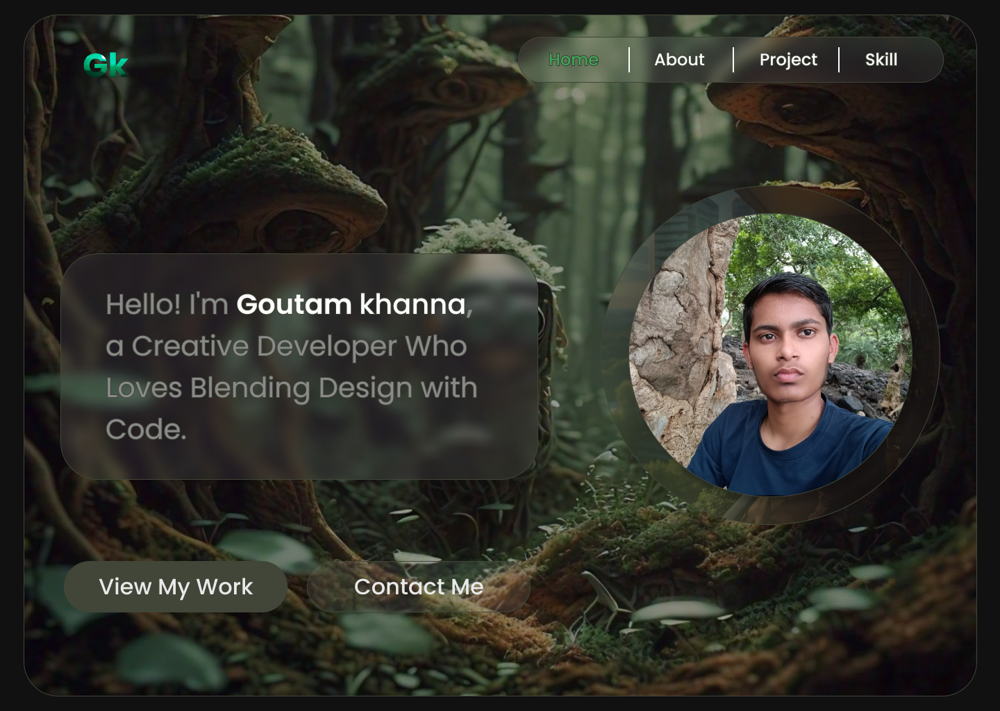

# Hey, I'm Goutam Khanna 👋

Welcome to my portfolio! This project showcases my skills and projects as a web developer, with a focus on design and usability.

## Overview

This portfolio was built using **HTML** and **CSS** with designs created in **Figma**. It is hosted on **GitHub Pages** and is responsive for both laptop and mobile devices.

Check out the [Figma Design](https://www.figma.com/design/DpP3609hhixIHEd6VGBSeN/Untitled?node-id=0-1&t=L6Nrfp5YGe8tL3aO-0 ) for a detailed look at the design process.

### Skills

- **Frontend Development**: HTML, CSS
- **UI Design**: Figma

### View the Portfolio

You can view the live version of the portfolio here: [Portfolio Link](https://dark1arrow.github.io/Portfolio/)

### Credits

This portfolio was designed and developed by Goutam Khanna.
